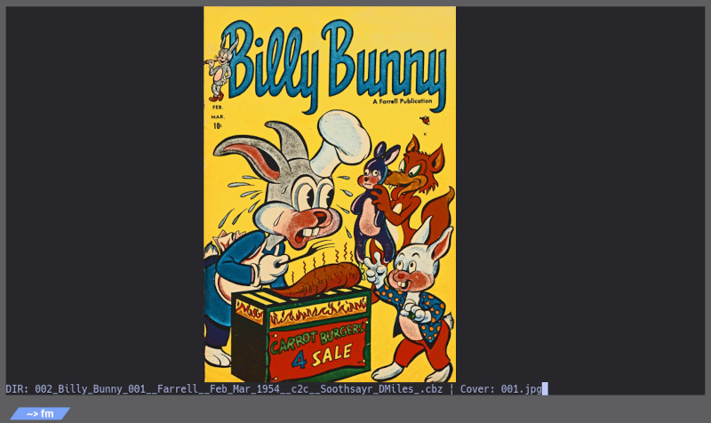
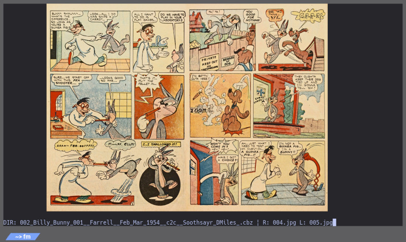

# TerMa (TerminalMangaViewer)

> **Ter**minal **Ma**nga Viewer — *"タマ"*

Terminal manga viewer for **Kitty** and **WezTerm**.  
Displays cover pages and spread (見開き) pages using native terminal image protocols.

---

## Features

- 1枚目は表紙として中央表示、2枚目以降は見開き（右綴じ）で表示
- Kitty（icat）または WezTerm（imgcat）を自動検出して切り替え
- キーボード主体の操作、マウスクリックにも対応
- 兄弟ディレクトリを巻として自然順ソートでブラウズ
- Pillow がインストールされていればアスペクト比を正確に補正
- `TERMA_DEBUG=1` でデバッグログ出力

### サンプル画像


*表紙ページは中央に表示されます*


*2枚目以降は見開き（右綴じ）で表示されます*

---

## Requirements

| 要件 | 備考 |
|------|------|
| Python 3.8+ | 標準ライブラリのみで動作（Pillow はオプション） |
| Kitty または WezTerm | どちらか一方があれば動作 |
| Pillow | オプション。アスペクト比補正に使用 |

推奨フォント: **HackGen Console NF**

---

## Installation

```bash
git clone https://github.com/radiconkid/TerminalMangaViewer.git
cd TerminalMangaViewer

# Pillow（オプション）
pip install pillow

# 実行権限を付与
chmod +x terma.py
```

### pipx でインストールする場合（任意）

```bash
pipx install .
```

---

## Usage

```bash
./terma.py /path/to/manga/volume01
```

`volume01` と同階層にある兄弟ディレクトリが自動的に次の巻として認識されます。

```
manga/
├── volume01/   ← ここを指定すると…
├── volume02/   ← 次の巻として自動認識
└── volume03/
```

---

## Key Bindings

| キー | 動作 |
|------|------|
| `j` / `←` / `Enter` | 次のページへ |
| `k` / `l` / `→` | 前のページへ |
| `0` | 最初のページ（表紙）へ |
| `9` | 最後の見開きへ |
| `,` | 次の巻へ |
| `.` | 前の巻へ |
| `q` / `Q` / `h` | 終了 |

### マウス操作

> ⚠️ マウス操作は現在不具合が多く、未完成です。

| 操作 | 動作 |
|------|------|
| 左クリック | 次のページへ |
| 右クリック | 前のページへ |
| 中クリック | 終了 |

---

## Terminal Support

| ターミナル | プロトコル | 検出方法 |
|------------|-----------|---------|
| Kitty | Kitty Graphics Protocol（icat） | `KITTY_WINDOW_ID` 環境変数 |
| WezTerm | imgcat | `WEZTERM_PANE` 環境変数 |

tmux 経由でも環境変数による判定が有効です。

---

## Debug

```bash
MANGA_VIEWER_DEBUG=1 ./terma.py /path/to/manga/volume01
```

ログは `~/terma-debug.log` に出力されます。

---

## Project Structure

```
TerminalMangaViewer/
├── terma.py   # メインスクリプト
├── requirements.txt      # Pillow（optional）
├── README.md
└── LICENSE
```

---

## Contributing

Issue・PR ともに歓迎します。

- バグ報告の際は OS・ターミナル名・バージョン・デバッグログを添えてください
- 機能追加の提案は Issue で先に議論していただけると助かります

---

## License

[MIT](LICENSE)
